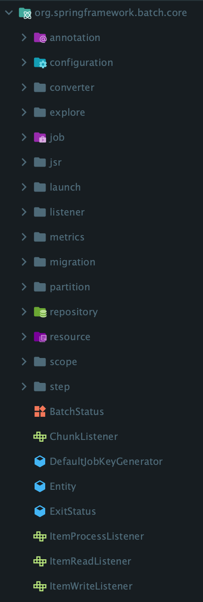
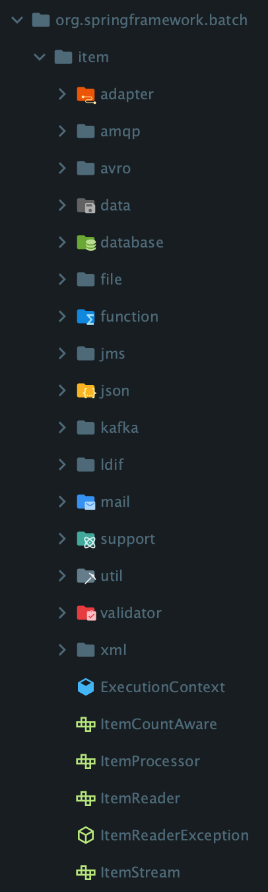
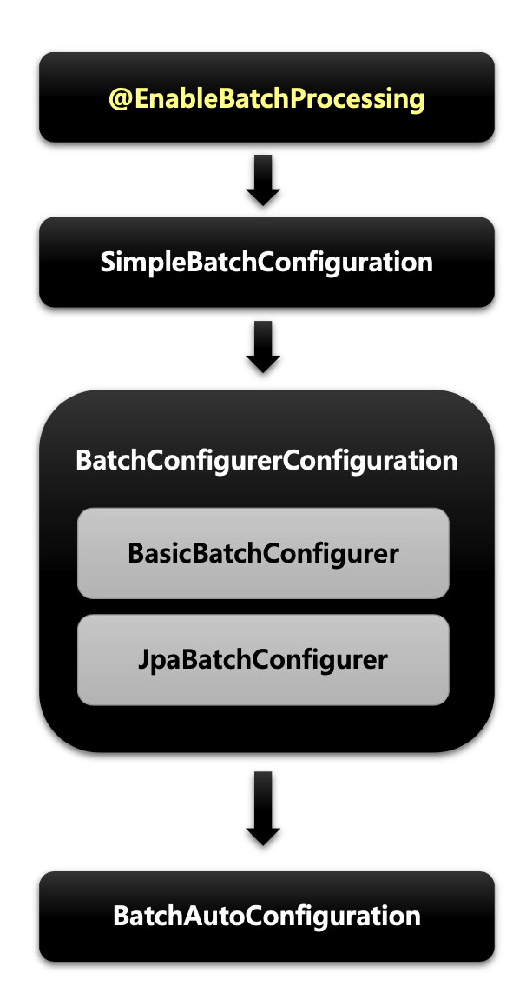

# 서론

[배치, Spring Batch란 무엇인가](https://longnh214.github.io/posts/Why_use_Spring_Batch/) 포스트에서 배치와 Spring Batch가 필요한 이유와 내부 개념에 대해 간단히 알아보았다.  
이번 포스트에서는 Spring Batch 프로젝트를 생성할 때 필요한 의존성과 필수 설정에 대해 알아보고자 한다.

## build.gradle 의존성

```gradle
dependencies {
    implementation 'org.springframework.boot:spring-boot-starter-batch'
    implementation 'org.springframework.boot:spring-boot-starter-data-jpa'
    compileOnly 'org.projectlombok:lombok'
    runtimeOnly 'com.h2database:h2'
    runtimeOnly 'mysql:mysql-connector-java'
}
```

> Spring Batch를 이용해서 DB의 데이터를 관리할 것이기 때문에 Spring Batch 뿐만 아니라 h2, MySQL의 의존성도 추가해주었다.

## Spring Batch 내부 패키지 분석


`spring-boot-starter-batch` 의존성을 Gradle을 통해 다운로드 받으면 내부에는 지난 포스팅에서 본 `spring-batch-core`, `spring-batch-infrastructure` 패키지가 있는 것을 볼 수 있다.

<div style="text-align: left;">
    
</div>

> `spring-batch-core` 패키지 내에는 `Job`, `Step`, `Listener` 에 대한 클래스가 구현되어있다.

<div style="text-align: left;">
    
</div>

> `spring-batch-infrastructure` 패키지 내에는 Spring Batch에서 데이터를 불러올 방식 (`File`, `Data`, `Json`, `Kafka`) 에 대한 클래스의 정보가 담겨 있다.

## Spring Batch 이용시 설정

### MainApplication.java

```java
@SpringBootApplication
@EnableBatchProcessing // Spring Batch 이용 시 필수 설정 Annotation
public class MainApplication {

    public static void main(String[] args) {
        SpringApplication.run(BatchDemoApplication.class, args);
    }

}
```

> 위 예시처럼 Spring Boot Application 내에서 Spring Batch 프레임워크를 이용하려면 `@EnableBatchProcessing` 어노테이션을 선언 해주어야한다.  

[Spring Batch Java Config](https://docs.spring.io/spring-batch/docs/4.3.x/reference/html/job.html#javaConfig) 를 참고하면 `@EnableBatchProcessing`를 통해 Spring Batch의 기본 Bean을 구성할 수 있다고 한다.

## @EnableBatchProcessing 의 역할

> `@EnableBatchProcessing` 어노테이션이 선언된 어플리케이션이 실행되면 이미지와 같은 순서로 설정 관련 프록시 객체가 실행되어 자동으로 Spring Batch에 필요한 설정을 해준다.

<div style="text-align: left;">
    
</div>

1. `BatchAutoConfiguration`

   - Spring Batch가 초기화될 때 자동으로 실행되는 설정 클래스
   - `Job` 을 수행하는 `JobLauncherApplicationRunner` 빈을 생성  

2. `SimpleBatchConfiguration`

   - `JobBuilderFactory` 와 `StepBuilderFactory` 생성
   - Spring Batch의 주요 구성 요소 생성 (프록시 객체로 생성됨)

3. `BatchConfigurerConfiguration`
   - `BasicBatchConfigurer`
     - `SimpleBatchConfiguration` 에서 생성한 프록시 객체의 실제 대상 객체를 생성하는 설정 클래스
     - 빈으로 의존성을 주입받아서 주요 객체들을 참조해서 사용할 수 있다.
   - `JpaBatchConfigurer`
     - JPA 관련 객체를 생성하는 설정 class
     - 사용자 정의 `BatchConfigurer` 인터페이스를 구현하여 사용할 수 있다.

> [Spring Batch Java Config](https://docs.spring.io/spring-batch/docs/4.3.x/reference/html/job.html#javaConfig) 공식 문서에 의하면 `BatchConfigurer`에 의해 아래와 같은 Bean이 내부적으로 자동 설정이 된다고 한다. 그리고 커스터마이징 하고 싶다면 `DefaultBatchConfigurer`를 상속받은 클래스를 재정의 할 수 있다.

- `JobRepository`: bean name "jobRepository"
- `JobLauncher`: bean name "jobLauncher"
- `JobRegistry`: bean name "jobRegistry"
- `PlatformTransactionManager`: bean name "transactionManager"
- `JobBuilderFactory`: bean name "jobBuilders"
- `StepBuilderFactory`: bean name "stepBuilders"

## @EnableBatchProcessing 의 modular 설정

> `@EnableBatchProcessing` 어노테이션의 내부 클래스 `BatchConfigurationSelector` 내부를 보면 modular 속성에 따라 `SimpleBatchConfiguration`과 `ModularBatchConfiguration`으로 세부 설정이 나뉘는 것을 알 수 있다.

```java
public class BatchConfigurationSelector implements ImportSelector {
    @Override
    public String[] selectImports(AnnotationMetadata importingClassMetadata) {
        Class<?> annotationType = EnableBatchProcessing.class;
        AnnotationAttributes attributes = AnnotationAttributes.fromMap(importingClassMetadata.getAnnotationAttributes(
                annotationType.getName(), false));
        Assert.notNull(attributes, String.format("@%s is not present on importing class '%s' as expected",
                annotationType.getSimpleName(), importingClassMetadata.getClassName()));

        String[] imports;
        if (attributes.containsKey("modular") && attributes.getBoolean("modular")) {
            imports = new String[] { ModularBatchConfiguration.class.getName() };
        }
        else {
            imports = new String[] { SimpleBatchConfiguration.class.getName() };
        }
        return imports;
    }
}
```

> modular 설정이란 Spring Batch에서 모듈화된 설정을 사용할 지에 대한 flag 속성이고, 기본값인 `false`라면 Job이 하나의 애플리케이션 컨텍스트 안에서 관리된다는 의미이다. 반대로 `true`라면 각 Job을 서브 애플리케이션 컨텍스트로 분리해서 실행할 수 있고, Job마다 독립적으로 설정하고 관리하고 싶을 때 설정하면 된다.

## ⚠️ Spring Boot 3.x 버전 이후부터는 @EnableBatchProcessing이 필수가 아니다?

[Spring Boot 3 Migration](https://www.baeldung.com/spring-boot-3-migration#spring-batch)

<https://github.com/spring-projects/spring-boot/issues/33435>

<https://github.com/spring-projects/spring-boot/issues/32330#issuecomment-1252444308>

위 링크의 내용을 보면 Spring Boot 3 버전 이상에서는 `@EnableBatchProcessing` 어노테이션을 사용하면 Spring Batch에 대한 Spring Boot의 자동 설정이 꺼지기 때문에 사용하지 않는 것을 권장한다.

> 💡 공부하면서 알게된 사실은 Spring Boot 3 버전 이상부터는 MVC나 WebFlux와 같은 다양한 프레임워크를 사용할 때 `@Enable*` 어노테이션은 자동 설정이 아닌 **커스터마이징 Configuration을 선언하고 싶을 때에만** 작성하는 관례가 생겼다고 한다.

### 출처

- [Spring Batch - 정수원님 인프런 강의](https://www.inflearn.com/course/%EC%8A%A4%ED%94%84%EB%A7%81-%EB%B0%B0%EC%B9%98/dashboard)
- [Spring Batch Java Config](https://docs.spring.io/spring-batch/docs/4.3.x/reference/html/job.html#javaConfig)
- [Spring Boot 3 Migration](https://www.baeldung.com/spring-boot-3-migration#spring-batch)
