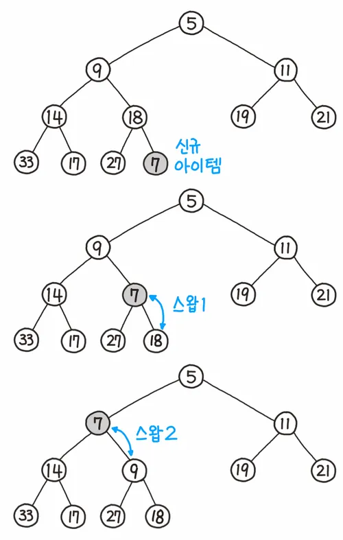
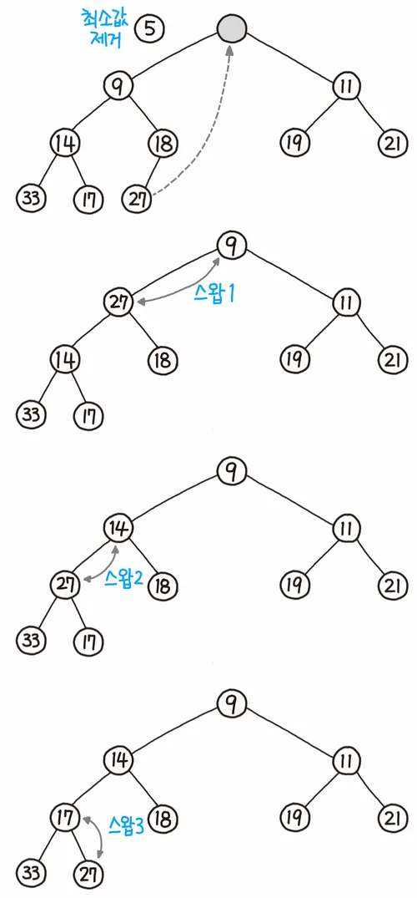
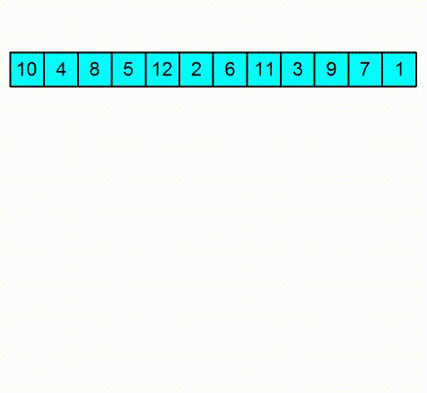

# 서론

지난 [Stack vs Queue](https://longnh214.github.io/posts/Java_Stack_Queue/) 포스팅에 이어서 `java.util.*` 패키지에 구현된 `PriorityQueue`와 내부 구현 자료구조인 Heap에 대해서 알아보고자 한다.

<br>
<br>

# 정의

## PriorityQueue

> 우선순위 큐는 큐에 원소 별로 '우선순위'라는 개념을 도입한 자료구조를 의미한다.

### 구현 방식에 따른 시간 복잡도

| 구현 방법                               | enqueue() 삽입 | dequeue() 삭제 |
| --------------------------------------- | -------------- | -------------- |
| 배열 (unsorted array)                   | O(1)           | O(N)           |
| 연결 리스트(unsorted linked list)       | O(1)           | O(N)           |
| 정렬된 배열(sorted array)               | O(N)           | O(1)           |
| 정렬된 연결 리스트 (sorted linked list) | O(N)           | O(1)           |
| 힙 (heap)                               | O(logN)        | O(logN)        |

> 다양한 방식으로 우선순위 큐를 구현할 수 있지만 그 중에 힙으로 구현한 우선순위 큐가 삽입, 삭제에 대해서 O(logN)으로 가장 효율적이다. 바로 힙이 어떤 자료구조인지 알아보자.

<br>
<br>

# 힙과 트리

> 힙은 완전 이진 트리로 이루어져있고, 부모 노드가 자식 노드보다 커야하는 최대 힙과, 반대로 부모 노드가 자식 노드보다 작아야하는 최소 힙과 같이 특수한 조건의 트리이다.  
> 완전 이진 트리란, 마지막 레벨의 노드를 제외하고 그 윗 레벨의 노드들은 모두 자식 노드가 2개씩 꽉 차있어야하는 조건의 이진 트리다.

## 힙에서 데이터의 삽입과 삭제

> 💡 특수한 트리 형태의 힙 자료구조에서 데이터가 삽입, 삭제될 때 내부적으로 어떤 로직이 동작하는 지 보자.

### 데이터의 삽입

1. 가장 끝의 자리에 노드를 삽입한다.
2. 그 노드와 부모 노드를 서로 비교한다.
3. 규칙에 맞으면 그대로 두고, 그렇지 않으면 부모와 교환한다. (부모 노드는 삽입된 위치의 인덱스 번호에서 /2를 하면 쉽게 구할 수 있다.)
4. 규칙에 맞을 때까지 3번 과정을 반복한다.

<div style="text-align: left;">
    
</div>

### 데이터의 삭제

1. 루트 노드를 제거한다.
2. 루트 자리에 가장 마지막 노드를 삽입한다.
3. 올라간 노드와 그의 자식 노드(들)와 비교한다.
4. 조건에 만족하면 그대로 두고, 그렇지 않으면 자식과 교환한다.
   - 최대 힙
       1. 부모보다 더 큰 자식이 없으면 교환하지 않고 끝낸다.
       2. 부모보다 더 큰 자식이 하나만 있으면 그 자식하고 교환하면 된다.
       3. 부모보다 더 큰 자식이 둘 있으면 자식들 중 큰 값과 교환한다.
   - 최소 힙
       1. 부모보다 더 작은 자식이 없으면 교환하지 않고 끝낸다.
       2. 부모보다 더 작은 자식이 하나만 있으면 그 자식하고 교환하면 된다.
       3. 부모보다 더 작은 자식이 둘 있으면 자식들 중 작은 값과 교환한다.
5. 조건을 만족할 때까지 4의 과정을 반복한다.

<div style="text-align: left;">
    
</div>

## 배열로 이루어진 Heap

> ⚠️ 힙은 보통 배열로 구현되어져 있는데 트리 형태의 힙을 배열로 관리하려면 인덱스를 아래의 기준으로 부모와 자식 노드의 위치를 찾을 수 있다.  
> 루트 노드는 편의 상 인덱스 1로 설정하고,  
> 왼쪽 자식 노드는 (parent * 2) 인덱스로 나타내고,  
> 오른쪽 자식 노드는 (parent * 2) + 1로 나타낸다.  
> 현재 노드의 부모 노드는 (child - 1) / 2로 찾을 수 있다.  
> ⚠️ 실제 Java의 PriorityQueue는 배열의 0번 인덱스부터 데이터를 저장한다. 

## 힙의 활용 사례

- 우선순위 큐
- 다익스트라 알고리즘(최단 경로 찾을 때)
- 힙 정렬 (heap sort)
- [허프만 코드](https://namu.wiki/w/%ED%97%88%ED%94%84%EB%A7%8C%20%EC%BD%94%EB%93%9C)
- CPU 스케줄링 (예상 소요 시간, 중요도 우선순위 기반 정렬)
  
> ⚠️ Java의 메모리 구조 중 객체를 관리할 때 사용되는 힙 영역은 힙 자료구조와는 관련이 없다.

<br>
<br>

# Java의 PriorityQueue

## PriorityQueue.java에서 데이터는 어떤 타입, 클래스로 관리되어질까?

`java.util.PriorityQueue` 클래스를 통해 Java util 패키지에서 우선순위 큐가 어떻게 구현되어있는지 보려고 한다.

```java
public class PriorityQueue<E> extends AbstractQueue<E> implements java.io.Serializable {
    transient Object[] queue; // non-private to simplify nested class access
    //...
}
```  

위 코드에서 우선순위 큐 내에서 사용되는 힙은 배열로 관리되어있다는 점을 알 수 있다.

## PriorityQueue.java에서 데이터의 삽입과 삭제는 어떻게 구현되어 있을까?

먼저 데이터의 삽입 부터 살펴보면, `PriorityQueue.java`에서 삽입에 대한 메소드는 `offer()`와 `add()`로 구성되어있다.

```java
public class PriorityQueue<E> extends AbstractQueue<E>
    implements java.io.Serializable {
    //...
    public boolean add(E e) {
        return offer(e);
    }

    public boolean offer(E e) {
        if (e == null)
            throw new NullPointerException();
        modCount++;
        int i = size;
        if (i >= queue.length)
            grow(i + 1);
        siftUp(i, e);
        size = i + 1;
        return true;
    }
    //...
}
```

> 내부의 `grow()` 메소드는 내부적으로 PriorityQueue에서 관리되어지는 배열의 크기가 꽉 찼을 때 공간을 늘려주는 부분의 메소드이다.  
> `siftUp()` 메소드에서 위의 힙 내에서 삽입 로직(heapify)이 일어나게 되며 아래와 같이 Comparator가 구현된 객체와 아닌 제네릭(T)에 따라 다른 메소드가 실행된다.

```java
public class PriorityQueue<E> extends AbstractQueue<E> implements java.io.Serializable {
    //...
    private static <T> void siftUpComparable(int k, T x, Object[] es) {
        Comparable<? super T> key = (Comparable<? super T>) x;
        while (k > 0) {
            int parent = (k - 1) >>> 1;
            Object e = es[parent];
            if (key.compareTo((T) e) >= 0)
                break;
            es[k] = e;
            k = parent;
        }
        es[k] = key;
    }

    private static <T> void siftUpUsingComparator(
        int k, T x, Object[] es, Comparator<? super T> cmp) {
        while (k > 0) {
            int parent = (k - 1) >>> 1;
            Object e = es[parent];
            if (cmp.compare(x, (T) e) >= 0)
                break;
            es[k] = e;
            k = parent;
        }
        es[k] = x;
    }
    //...
}
```

인덱스 기반 (x >>> 1 == x / 2) 계산으로 부모 노드의 값과 현재(자식) 노드의 값을 비교하며 swap이 필요하다면 swap을 하는 로직을 볼 수 있다.

그리고 다음으로 힙에서 데이터가 삭제되는(root 노드의 값이 꺼내지는) 부분에 대해서 보면, `PriorityQueue.java`에서 삭제에 대한 메소드는 `poll()`로 이루어져있다.

```java
public class PriorityQueue<E> extends AbstractQueue<E> implements java.io.Serializable {
    //...
    public E poll() {
        final Object[] es;
        final E result;

        if ((result = (E) ((es = queue)[0])) != null) {
            modCount++;
            final int n;
            final E x = (E) es[(n = --size)];
            es[n] = null;
            if (n > 0) {
                final Comparator<? super E> cmp;
                if ((cmp = comparator) == null)
                    siftDownComparable(0, x, es, n);
                else
                    siftDownUsingComparator(0, x, es, n, cmp);
            }
        }
        return result;
    }
    //...
    private static <T> void siftDownComparable(int k, T x, Object[] es, int n) {
        // assert n > 0;
        Comparable<? super T> key = (Comparable<? super T>)x;
        int half = n >>> 1;           // loop while a non-leaf
        while (k < half) {
            int child = (k << 1) + 1; // assume left child is least
            Object c = es[child];
            int right = child + 1;
            if (right < n &&
                ((Comparable<? super T>) c).compareTo((T) es[right]) > 0)
                c = es[child = right];
            if (key.compareTo((T) c) <= 0)
                break;
            es[k] = c;
            k = child;
        }
        es[k] = key;
    }

    private static <T> void siftDownUsingComparator(
        int k, T x, Object[] es, int n, Comparator<? super T> cmp) {
        // assert n > 0;
        int half = n >>> 1;
        while (k < half) {
            int child = (k << 1) + 1;
            Object c = es[child];
            int right = child + 1;
            if (right < n && cmp.compare((T) c, (T) es[right]) > 0)
                c = es[child = right];
            if (cmp.compare(x, (T) c) <= 0)
                break;
            es[k] = c;
            k = child;
        }
        es[k] = x;
    }
    //...
}
```

> `queue[0]`의 값을 먼저 result 변수에 저장한 뒤, 위에서 본 힙의 삭제 로직(heapify)처럼 배열의 마지막 인덱스 값을 루트로 올린다.  
> 그 후, 자식 노드들과 값을 비교하면서 왼쪽 자식 노드와 오른쪽 자식 노드들 중 정렬의 우선순위가 높은 값의 자식 노드와 swap하면서 적당한 위치를 찾아간다.

## 힙 정렬

<div style="text-align: left;">
    
</div>

1. 원소들을 전부 힙에 삽입한다.
2. 힙의 루트에 있는 값은 남은 수들 중에서 최솟값(혹은 최댓값)을 가지므로 루트를 출력하고 힙에서 제거한다.
3. 힙이 빌 때까지 2의 과정을 반복한다.

> O(N^2)의 시간 복잡도인 선택 정렬과 유사한 로직이지만 가장 큰 원소를 찾아낼 때 매 번 순회하면서 찾는지 힙을 이용해서 찾는지가 유일한 차이점이다.  
> 힙 정렬은 추가적인 메모리가 전혀 필요없다는 점과 항상 O(NlogN) 정렬의 성능을 발휘하는 장점이 있다. 하지만 실제로는 퀵 정렬이 힙 정렬보다 일반적인 경우에 빠르게 동작한다.

<br>
<br>

## 💡 for(int num: pq){sout(num);} 우선순위대로 순회될까?

```java
public static void main(String[] args) {
    PriorityQueue<Integer> pq = new PriorityQueue<>();

    for(int i=0;i<10;i++){
            int temp = (int)(Math.random() * 100); // 0 ~ 100
            pq.offer(temp);
    }

    for(int num : pq){ //넣은 순서
        System.out.println(num);
    }
}
```

> 위와 같은 코드를 실행하면 어떤 결과가 나올까? 삽입한 순서? 우선순위에 따른 순회? 실제로 실행해보았다.

```txt
-------offer한 순서-------
79
83
50
45
52
2
79
6
10
49
-------실제 enhanced for문으로 순회한 순서-------
2
6
45
10
49
79
79
83
50
52
```

> 위 코드를 실제로 실행해보았을 때 삽입한 순서대로 순회하지 않았고, 우선순위 대로 순회하지도 않았다. 그렇다면 순회된 순서는 어떤 기준일까?  
> 생각해보니 힙에서 관리되어지는 배열의 인덱스 규칙처럼 PriorityQueue의 내부는 배열로 구현한 힙을 관리하고 있기 때문에 순서도 배열에 실제 저장되어있는 heapify된 순서대로 출력되는듯 하다.

<br>
<br>

## 결론

Java로 알고리즘 문제를 풀 때 유용하게 사용했던 클래스 `PriorityQueue`에 대해서 살펴보았다. 내부 로직을 얕게 알고 있었지만 로직을 깊게 공부하니 신기하고 재미있는 부분도 있었다. PS에서 자주 쓰이는 다른 클래스들도 천천히 다뤄봐야겠다.

<br>
<br>

## 출처

- [힙 트리 - 나무위키](https://namu.wiki/w/%ED%9E%99%20%ED%8A%B8%EB%A6%AC#s-3.1)
- [정렬 알고리즘 - 나무위키](https://namu.wiki/w/%EC%A0%95%EB%A0%AC%20%EC%95%8C%EA%B3%A0%EB%A6%AC%EC%A6%98#s-4.2.2)
- Java util 패키지 `PriorityQueue.java`  
- [허프만 코드](https://namu.wiki/w/%ED%97%88%ED%94%84%EB%A7%8C%20%EC%BD%94%EB%93%9C)  
