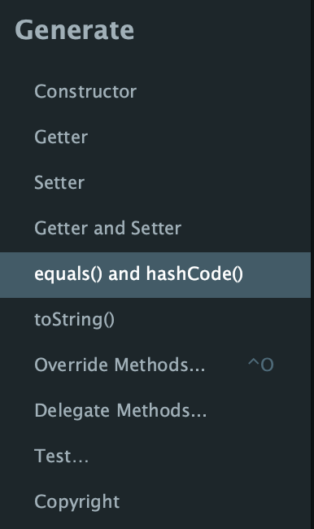
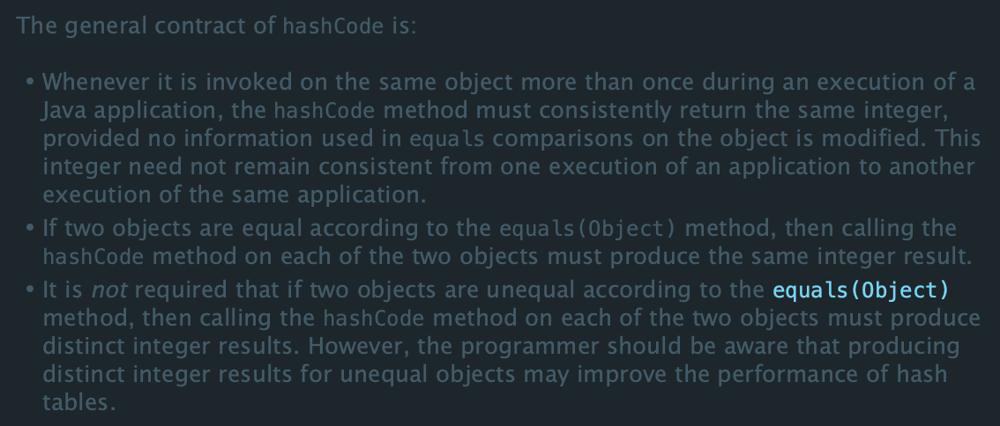

# 서론

Java로 개발할 때 객체가 같은지 확인하는 일이 다수 있다. 처음 객체지향에 접하고 Java를 배울 때 객체를 기본 타입 비교하는 것처럼 `==` 으로 비교할 때 원하는 조건(같음)이 만족하지 않는다는 것을 알았다. 이 점에 나아가서 Java Object 클래스의 `hashCode()` 메소드와 `equals()` 메소드와의 관계까지 알아보고자 한다.  

<br>
<br>

# 동일성과 동등성

> 갑자기 동일성과 동등성이 왜 나오는가? 싶긴 하지만 이 점이 Java에서 객체 비교를 할 때 중요한 개념 중에 하나라고 생각한다.  

우선 `objA == objB` 와 같이 `==` 으로 비교하는 것은 Java 내에서 objA와 objB 인스턴스가 힙에 저장되어있는 주소를 비교하는 것이다. 아래에 예시를 적어보았다.

```java
String s1 = new String("hello");
String s2 = new String("hello");
String s3 = s1; // s3는 s1이 참조하는 객체와 동일한 객체를 참조

System.out.println(s1 == s2); // false (s1과 s2는 "hello"라는 동일한 내용을 가지지만, Heap 메모리에서 각각 다른 String 객체를 생성했으므로 참조 주소가 다르다.)
System.out.println(s1 == s3); // true (s3는 s1의 참조 주소를 그대로 복사했으므로 동일한 객체를 참조한다.)

Integer i1 = new Integer(100);
Integer i2 = new Integer(100);
System.out.println(i1 == i2); // false (각각 다른 Integer 객체를 생성했으므로 참조 주소가 다름)

// 문자열 리터럴의 경우 String Constant Pool 때문에 특별한 동작을 보일 수 있음
String literal1 = "world";
String literal2 = "world";
System.out.println(literal1 == literal2); // true
```

마지막 예시인 `literal` 인스턴스의 경우에는 JVM에서 관리되는 String Constant Pool의 특성에 따라 리터럴 문법으로 선언된 문자열 객체는 `intern()` 메소드에 의해 내부적으로 같은 주소를 바라보게 맵핑되기 때문에 `literal1 == literal2`값은 `true`가 된다.  

<br>

## 동일성

위 예시에서 처럼 같은 값을 가지고 있지만, 내부 Heap에 저장된 주소(참조)에 따라 같지 않음을 나타내는 `==` 연산자가 나타내는 특성을 "동일성"이라고 한다.  

<br>

## 동등성

먼저 예시를 보면,

```java
String s1 = new String("hello");
String s2 = new String("hello");

System.out.println(s1.equals(s2)); // true (String 객체 내부 값이 같다.)

Integer i1 = new Integer(100);
Integer i2 = new Integer(100);

System.out.println(i1.equals(i2)); // true (Integer 객체 내부 값이 같다.)
```

위의 예시에서 썼던 인스턴스를 그대로 가져와서 `==`이 아닌 `equals()` 메소드로 비교했을 때에는 원하는 대로 내부 필드의 값을 비교해서 `true`로 반환했다.  
이와 같이 객체 내부 필드의 값을 초점에 맞춰서 비교하는 특성을 "동등성"이라고 한다.

> 💡 Java의 `Object` 클래스는 `equals()` 메소드를 가지고 있다. 하지만 `Object` 클래스의 `equals()` 메소드 내에서는 `==` 연산자와 같이 "동일성" 비교를 하고 있다.  
> 따라서 모든 클래스는 `Object` 클래스를 상속받고 있기 때문에 각 클래스 별로 올바르게 `equals()` 메소드를 구현하는 게 객체 지향 프로그래밍에서 중요하다.

<br>
<br>

# IntelliJ 에서의 equals 자동 완성

<div style="text-align: center;">
    
</div>

실제 IntelliJ에서 클래스를 직접 생성해서 `equals()` 메소드를 재정의하려고 하면, `hashCode()` 메소드도 같이 재정의하도록 되어있다. 이유가 뭘까?

<br>
<br>

# equals()와 hashCode()의 상관 관계

```java
class Person{
    int age;
    String name;

    Person(String name, int age){
        this.name = name;
        this.age = age;
    }

    public boolean equals(Object o) {
        if (this == o) return true;
        if (o == null || getClass() != o.getClass()) return false;

        Person person = (Person) o;

        if (age != person.age) return false;
        return name.equals(person.name);
    }
}
```

위처럼 `Person` 클래스에 `equals()` 메소드만 오버라이딩 했다고 가정하고, 아래 예시를 실행해보겠다.

```java
Person p1 = new Person("naknak", 19);
Person p2 = new Person("naknak", 19);

System.out.println(p1.equals(p2)); // true

System.out.println(p1.hashCode()); // 1802598046
System.out.println(p2.hashCode()); // 659748578
```

원하는 대로 `equals()` 메소드 반환 결과는 `true`로 나왔지만, `hashCode()` 값은 두 값이 다르게 나왔다.  
일반적으로 `Object` 클래스의 `hashCode()` 메소드에서는 내부 JVM 수준의 코드에서 객체가 저장된 주소를 해시값으로 반환한다.

<br>

## 💡 이 객체들을 Hash 기반의 Collection에 넣으면 어떻게 될까?

```java
Person p1 = new Person("naknak", 19);
Person p2 = new Person("naknak", 19);

Set<Person> personSet = new HashSet<>();

personSet.add(p1);
personSet.add(p2);

System.out.println(personSet.size()); // 2
```

HashSet은 같은 값에 대해 중복을 허용하지 않는 Collection 자료구조이다. 하지만 동등성에 만족하는(논리적으로 값이 같은) 두 객체를 HashSet에 넣었을 때 크기가 1이 되어야한다고 예상했지만 2가 반환됐다.  

<br>

## hashCode()의 목적

<div style="text-align: center;">
    
</div>

실제 Java의 `Object` 클래스의 `hashCode()` 부분에 위와 같이 메소드의 목적이 주석으로 적혀있다.

```text
<hashCode() 메서드의 일반 규약>

자바 애플리케이션이 실행되는 동안, 한 객체에 대해 hashCode 메서드를 여러 번 호출할 때마다, 
그 객체의 equals 비교에 사용되는 정보가 변경되지 않았다면 항상 동일한 정수 값을 일관되게 반환해야 합니다.
이 정수 값은 애플리케이션을 재실행했을 때 이전 실행과 동일하게 유지될 필요는 없습니다.

equals(Object) 메서드에 따라 두 객체가 같다고(equal) 판단된다면, 
두 객체 각각에 대해 hashCode 메서드를 호출했을 때 반드시 동일한 정수 결과를 생성해야 합니다.

equals(Object) 메서드에 따라 두 객체가 같지 않다고(unequal) 판단될 때, 
두 객체 각각에 대해 hashCode 메서드를 호출했을 때 반드시 다른 정수 결과를 생성해야 하는 것은 아닙니다. 
하지만, 개발자는 같지 않은 객체에 대해 서로 다른 정수 결과를 생성하는 것이 
해시 테이블(Hash Table)의 성능을 향상시킬 수 있음을 인지해야 합니다.
```

해석을 읽어보고 요약해보면, `equals()` 결과값이 true라면 `hashCode()` 값이 같아야하고, 만약 `hashCode()`의 값이 다르다면 해시 테이블의 성능에 문제가 있을 것임을 나타낸다. 위의 HashSet에서 보인 예시와 같다.

<br>

## equals()와 hashCode() 재정의 후 테스트

```java
class Person{
    int age;
    String name;

    Person(String name, int age){
        this.name = name;
        this.age = age;
    }

    public boolean equals(Object o) {
        if (this == o) return true;
        if (o == null || getClass() != o.getClass()) return false;

        Person person = (Person) o;

        if (age != person.age) return false;
        return name.equals(person.name);
    }

    public int hashCode() {
        int result = age;
        result = 31 * result + (name != null ? name.hashCode() : 0);

        return result;
    }
}
```

기존 위의 예시 `Person`에서 `hashCode()`를 재정의하고 다시 호출해보았다.

```java
Person p1 = new Person("naknak", 19);
Person p2 = new Person("naknak", 19);

System.out.println(p1.equals(p2)); // true

System.out.println(p1.hashCode()); // -1052882099
System.out.println(p2.hashCode()); // -1052882099

Set<Person> personSet = new HashSet<>();

personSet.add(p1);
personSet.add(p2);

System.out.println(personSet.size()); // 1
```

<br>
<br>

# 그렇다면 왜 hashCode()에서는 31이라는 숫자를 사용할까?

위 예시에서 사용했던 `Person` 객체에 대한 `hashCode()`이다. result에 각 필드값에 31을 곱해서 누적합을 진행하는 것을 볼 수 있다.

```java
public int hashCode() {
    int result = age;
    result = 31 * result + (name != null ? name.hashCode() : 0);

    return result;
}
```

<br>

## 왜 31일까?

그 이유에 대해서 나름대로 생각해보고 찾아봤다.

<br>

### 1. 31이 홀수이고, 소수이기 때문이다.

- 31은 소수이다. 그리고 `hashCode()`는 해시값을 반환하기 위한 메소드이다. 내부적으로 해시 충돌을 최소화하려면 값을 곱했을 때 2진수 값이 골고루 분산되어야하고, 홀수를 곱해야 마지막 자리수(2진수 기준)를 효율적으로 사용할 수 있다.
- 만약 곱하는 숫자가 31이 아니라 짝수이고 곱했을 때 오버플로우가 발생한다면 기존의 정보를 잃을 수 있다.

<br>

### 2. 31은 2^5 - 1로, 비트 연산에 최적화 되어있다.

- 특정 값 X에 31을 곱한다고 했을 때,
- X * 31
- X * (32 - 1)
- X * 32 - X
- (X << 5) - X
- 순서대로 비트 시프트 연산과 빼기 연산자를 이용해서 JVM에서 최적화된 빠른 계산이 가능하다.

<br>
<br>

## 결론

> 자주 사용하는 `equals()`메소드와 `hashCode()`메소드의 관계, 올바르게 재정의 해야하는 이유에 대해서 알아보았다. 다음에는 hash와 해시 충돌, hash를 이용하는 Collection인 HashMap에 대해서 알아볼 것이다.

<br>
<br>

## 출처

- Java 11 Object.java