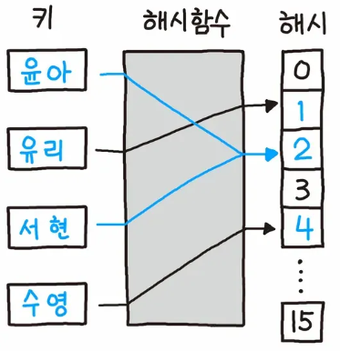
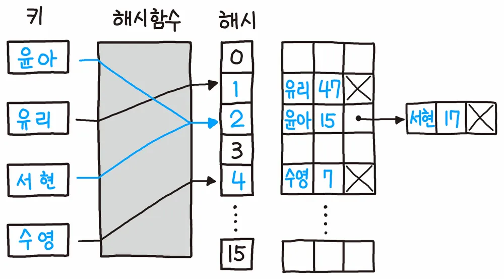
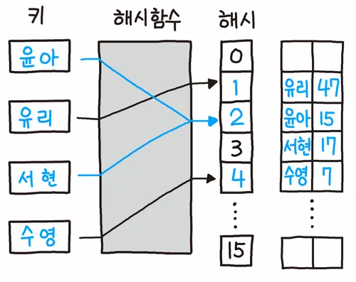

# 서론

실제로 알고리즘 문제를 풀 때 Java에서 `HashMap`, `HashSet`과 같은 구현체를 자주 사용하곤 한다. 이 중에서 `Hash`라는 키워드가 왜 사용되는걸까 궁금하고, 해시에 대해 더 자세히 공부해보고자 한다.

<br>
<br>

# 해시(Hash 함수)와 해시 테이블

<div style="text-align: center;">
    
</div>

> 해시 함수는 임의의 데이터를 고정된 숫자 범위의 데이터로 맵핑하는 단방향 함수를 의미한다. 아무리 큰 수를 넣어도 정해진 범위 내의 숫자가 반환되어야한다. 주로 숫자의 나머지 값을 이용하기도 한다.(모듈러 연산)

> 해시 테이블은 해시 함수를 기반으로 하는 자료구조이다. 배열의 색인(index)에 해시 함수 반환 값을 사용하는 자료구조이고, 정렬을 하지 않고도 빠른 조회나 빠른 삽입이 가능하다.

<br>
<br>

# 해시 충돌(Hash Collision)과 대처하는 방법

<div style="text-align: center;">
    
</div>

> 해시 충돌이란 위 예시에서 '윤아'와 '서현'의 해시 함수 반환값이 2로 동일하다. 같은 해시 버킷을 가리키게 되기 때문에 해시 충돌이라고 한다.

<br>

## 개별 체이닝 (Separate Chaining)

<div style="text-align: center;">
    
</div>

해시 충돌이 일어난다면 내부 값을 연결 리스트 형태로 저장하는 방식이다. 특정 해시값에 대해 핫스팟 현상이 발생한다면 내부 연결 리스트 크기가 무수히 늘어날 수 있다는 점을 고려해야 한다.

<br>

## 개방 주소법 (Open Addressing)

<div style="text-align: center;">
    
</div>

해시 충돌 발생 시에 빈 해시 공간을 찾아 나서서 넣는 방식이다. 하지만 전체 슬롯 개수 이상을 저장할 수 없다는 단점이 있다.

<br>
<br>

# Java의 HashMap에서 해시 충돌을 대처하는 방법

> 💡 Java에서는 대체로 HashMap에서 개별 체이닝(Separate Chaining) 방식을 사용한다. 개방 주소법(Open Addressing)은 데이터를 삭제할 때 처리가 효율적이기 어렵기 때문에 사용이 되지 않는듯 하다.

<br>

## Java 8 이전

```java
public V put(K key, V value){ 
    if (table == EMPTY_TABLE) { 
        inflateTable(threshold); 
    }
    int hash = hash(key);

    // i 값이 해시 버킷은 인덱스이다.
    // indexFor() 메서드는 hash % table.length와 같은 의도의 메서드다.
    int i = indexFor(hash, table.length);

    // 해시 버킷에 있는 연결 리스트를 순회한다.
    // 만약 같은 키가 이미 저장되어 있다면 교체한다.
    for(Entry<K,V> e = table[i]; e != null; e = e.next){
        Object k;
        if (e.hash == hash && ((k = e.key) == key || key.equals(k))) {
            V oldValue = e.value;
            e.value = value;
            e.recordAccess(this);
            return oldValue;
        }
    }
 
    modCount++;

    // 아직 해당 키-값 쌍 데이터가 삽입된 적이 없다면 새로 Entry를 생성한다. 
    addEntry(hash, key, value, i);
    return null;
}
```

위의 '개별 체이닝'에서 본 방식처럼 해시 충돌이 발생한다면 연결 리스트의 크기가 증가하는 방식으로 구현되어있다.  
이 방식이라면 해시 충돌이 발생해서 특정 버킷에 대한 연결 리스트의 크기가 크다면, HashMap에서 원하는 O(1)에 가까운 조회 성능은 얻을 수 없게 될 것이다.(연결 리스트의 조회 성능은 최악의 경우 O(N))

<br>

## Java 8 이후 진화된 개별 체이닝

```java
static final int TREEIFY_THRESHOLD = 8;

static final int UNTREEIFY_THRESHOLD = 6;
```

💡 Java 8 버전 이후부터는 `TREEIFY_THRESHOLD` 기반으로 연결 리스트의 크기가 일정 값 이상으로 늘어나면, 내부 저장 형태가 연결 리스트에서 Tree 형태로 변환된다.(자세히는 Red-Black Tree)

그렇기 때문에 해시 충돌이 발생하더라도 특정 버킷에 대한 데이터 조회 시에 O(logN)으로 시간 복잡도가 줄어드는 이점이 생겼다.

<br>

## 해시 슬롯의 범위 늘리기(재해싱 or 리사이징)

```java
static final int DEFAULT_INITIAL_CAPACITY = 1 << 4; // aka 16

int threshold;

final float loadFactor;
```

💡 HashMap에서는 DEFAULT 해시 버킷 크기를 16으로 설정해두고 있는데, (DEFAULT_INITIAL_CAPACITY * loadFactor)만큼 버킷이 차게 되면 내부적으로 `resize()` 메소드에 의해 버킷 크기는 이전의 두 배로 늘어난다.

💡 `loadFactor`의 기본값은 `0.75`이다.

💡 해시 충돌에 의한 성능 저하 방지 및 적절한 공간 활용을 위해 설계된 재해싱, 해시 리사이징 로직이다.

<br>
<br>

# Java HashMap 내 해시 함수

```java
static final int hash(Object key){
    int h;
    return (key == null) ? 0 : (h = key.hashCode()) ^ (h >>> 16);
}
```

💡 HashMap은 key가 null을 허용하기 때문에 key가 null이라면 해시 함수의 반환값으로 0을 반환한다.

💡 그리고 null이 아니라면 key의 `hashCode()` 값과 그 값을 16번 오른쪽 시프트 연산한 값을 XOR 연산한다.

<br>

## 왜 hashCode() 값과 시프트 연산한 값을 XOR 하지?

XOR 연산은 아래와 같이 두 수에 대한 계산 결과값이 0과 1이 적절하게 1:1로 골고루 분산되는 것을 볼 수 있다.

| 변수   |     |     |     |     |
| ------ | --- | --- | --- | --- |
| A      | 0   | 0   | 1   | 1   |
| B      | 0   | 1   | 0   | 1   |
| 결과값 | 0   | 1   | 1   | 0   |

보통 AND, OR 연산은 값이 1이나 0으로 3:1의 비율로 치우쳐져 있다.

💡 일단 `key.hashCode()`의 반환값은 무조건 int형(32비트)이다. 그리고 `(key.hashCode() >>> 16)`은 `hashCode()` 값 중 상위 비트 16자리만 남을 것이다.

```java
h = key.hashCode() : 1010 1010 1010 1010 0101 0101 0101 0101
          h >>> 16 : 0000 0000 0000 0000 1010 1010 1010 1010
              결과값 : 1010 1010 1010 1010 1111 1111 1111 1111
```

> 위처럼 예시로 특정 key에 대해서 두 수를 XOR 연산한다면 0이나 1이든 0이랑 XOR 하면 그 수가 그대로 나올 것이다. (상위 비트의 경우)  
골고루 상위 비트 16자리와 하위 비트 16자리를 XOR로 섞어서(?) 해시 함수 반환값을 얻을 수 있다.  
2진수 관점에서 나누기 연산을 하면 하위 비트만 남게 된다.  
하지만 위 함수로 상위 비트와 하위 비트를 섞음으로써 다양한(?) 해시 함수 결과값이 나오게 된다.  
이 방식을 **해시 믹싱**, **비트 확산**이라고 한다.

<br>

## 결론

해시의 개념, 해시 함수, 해시 충돌, 충돌의 대처 방법에 대해서 알아볼 수 있었다. 그리고 Java에서는 이를 성능을 고려해서 어떻게 구현했는지 알 수 있었다. Java의 HashMap에 대해서만 알아봤지만 비슷한 HashTable, ConcurrentHashMap, LinkedHashMap에 대해서도 알아볼 것이다.

<br>

## 출처

- [Hash 나무위키](https://namu.wiki/w/%ED%95%B4%EC%8B%9C)

- [Java Hash - Naver D2](https://d2.naver.com/helloworld/831311)
