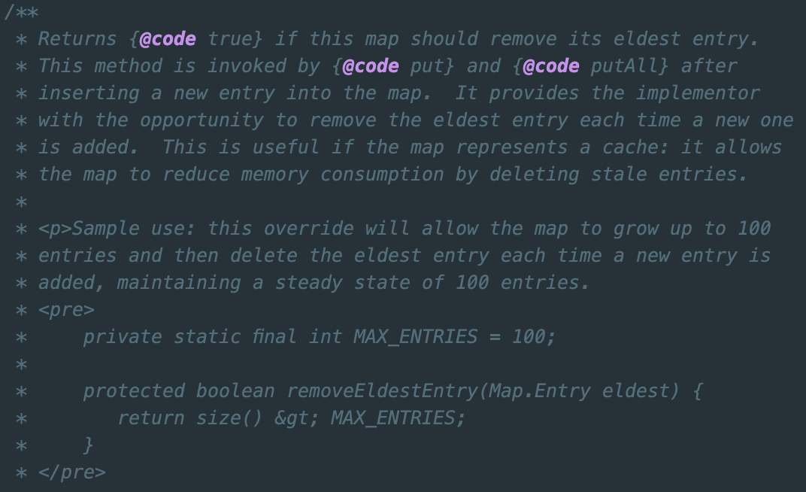

# 서론

[지난 Hash 포스팅](https://longnh214.github.io/posts/Java_Hash_1/)에서 해시와 HashMap에 대해서만 알아봤지만 비슷한 Hashtable 클래스나 HashMap에 특정 기능이 더해진 ConcurrentHashMap, LinkedHashMap에 대해서 알아보고자 한다.

# Hashtable vs HashMap

`Hashtable` 클래스와 `HashMap` 클래스의 일부분을 참고해서 공통점과 차이점을 비교해보려고 한다.

<br>

## Hashtable

```java
//...
private int threshold;

private float loadFactor;

private static class Entry<K,V> implements Map.Entry<K,V> {
    final int hash;
    final K key;
    V value;
    Entry<K,V> next;
    //...
}

public synchronized V put(K key, V value) {
    // Make sure the value is not null
    if (value == null) {
        throw new NullPointerException();
    }

    // Makes sure the key is not already in the hashtable.
    Entry<?,?> tab[] = table;
    int hash = key.hashCode();
    int index = (hash & 0x7FFFFFFF) % tab.length;
    @SuppressWarnings("unchecked")
    Entry<K,V> entry = (Entry<K,V>)tab[index];
    for(; entry != null ; entry = entry.next) {
        if ((entry.hash == hash) && entry.key.equals(key)) {
            V old = entry.value;
            entry.value = value;
            return old;
        }
    }

    addEntry(hash, key, value, index);
    return null;
}
//...
```

<br>

## HashMap

```java
//...
int threshold;

final float loadFactor;

static class Node<K,V> implements Map.Entry<K,V> {
    final int hash;
    final K key;
    V value;
    Node<K,V> next;
    //...
}

public V put(K key, V value) {
    return putVal(hash(key), key, value, false, true);
}
//...
```

<br>

## 공통점과 차이점

- 공통점
  - Hashtable의 Entry, HashMap의 Node 객체의 내부 필드는 같다.
  - `loadFactor`와 `threshold`처럼 버킷의 임계점 관련 변수도 똑같이 관리되어진다.
- 차이점
  - 멀티스레딩의 지원 유무
    - `Hashtable` 클래스는 `get`, `put`, `size`, `contains`, `isEmpty` 등 모든 메소드에 `synchronized` 키워드가 붙었다. 고로 성능이 좋지 않지만 멀티스레드 프로그래밍을 지원한다.
    - `HashMap` 클래스는 모든 메소드에 `synchronized` 키워드가 없어 싱글스레드 프로그래밍에 유리하다.
  - `null` 허용 여부
    - Hashtable은 `null`에 대한 키와 값 모두 허용하지 않는다.
    - HashMap은 `null`에 대한 키와 값 모두 허용한다.

⚠️ `Hashtable` 클래스는 모든 메소드를 호출할 때마다 락 체킹 비용이 발생해서 성능이 고려되지 않았다.

<br>
<br>

# Collections.synchronizedMap(Map<K,V> m)

아래 코드는 `Collections.java`의 `synchronizedMap` 메소드 일부분을 가져온 것이다.

```java
public static <K,V> Map<K,V> synchronizedMap(Map<K,V> m) {
    return new SynchronizedMap<>(m);
}

private static class SynchronizedMap<K,V>
    implements Map<K,V>, Serializable {
    private final Map<K,V> m; // Backing Map
    final Object mutex; // Object on which to synchronize

    public int size() {
        synchronized (mutex) {return m.size();}
    }
    public boolean isEmpty() {
        synchronized (mutex) {return m.isEmpty();}
    }
    public boolean containsKey(Object key) {
        synchronized (mutex) {return m.containsKey(key);}
    }
    public boolean containsValue(Object value) {
        synchronized (mutex) {return m.containsValue(value);}
    }
    public V get(Object key) {
        synchronized (mutex) {return m.get(key);}
    }
    //...
}
```

`Collections.synchronizedMap()`는 내부적으로 매개변수로 받은 Map을 `SynchronizedMap`로 감싼다.(wrapping한다.)  
내부적으로 위임 받은 원본 Map에 대한 모든 호출 내 각 연산에 동기화 처리(락 체킹) 로직을 추가한다.  
고로 원본 Map에 `Hashtable`처럼 모든 메소드에 락 체킹 비용이 추가되는 개념이라고 보면 된다.

<br>
<br>

## HashMap vs Hashtable vs ConcurrentHashMap

위 내용에서 `HashMap`과 `Hashtable`, `Collections.synchronizedMap()`의 동기화 및 스레드 안정성에 대해서 차이점을 알아보았다.  
`Hashtable`과 `Collections.synchronizedMap()`은 스레드 안전(Thread-safe)한 특징을 가지고 있지만 읽기와 쓰기 부분에서 모두 동기화 오버헤드가 발생해서 성능 저하를 일으킬 수 있었다.  

> 💡 Java에서 Map이라는 자료구조를 이용하면서 동기화 오버헤드와 성능 저하를 줄이면서 스레드 안전성을 최대한 챙길 수 없을까?  
>
> `ConcurrentHashMap` 클래스에 대해서 하나씩 설명하고자 한다.

<br>

우선 `ConcurrentHashMap`은 읽기에 대해서는 동기화 로직을 실행하지 않는다.  
이유는 내부 테이블(`Node<K,V>[] table;`)이 `volatile`로 선언되어있어서 모든 쓰기 작업은 해당 변수의 값을 메인 메모리에 즉시 반영하고, 모든 읽기 작업은 메인 메모리에서 최신값을 읽어오도록 보장한다.  

한 스레드가 `put` 작업을 통해서 테이블의 특정 버킷을 변경하거나 맵의 구조를 변경했을 때, `volatile`에 의해 그 변경 사항이 다른 스레드에게 즉시 보여질 수 있도록 보장되는 것이다.

```java
//ConcurrentHashMap.java

transient volatile Node<K,V>[] table;

public V get(Object key) { // synchronized 키워드가 없다.
    Node<K,V>[] tab; Node<K,V> e, p; int n, eh; K ek;
    int h = spread(key.hashCode());
    if ((tab = table) != null && (n = tab.length) > 0 && (e = tabAt(tab, (n - 1) & h)) != null) {
        if ((eh = e.hash) == h) {
            if ((ek = e.key) == key || (ek != null && key.equals(ek)))
                    return e.val;
        }
        else if (eh < 0)
            return (p = e.find(h, key)) != null ? p.val : null;
        while ((e = e.next) != null) {
            if (e.hash == h && ((ek = e.key) == key || (ek != null && key.equals(ek))))
                return e.val;
        }
    }
    return null;
}
```

<br>

그리고 `ConcurrentHashMap`의 `put` 메소드에 대한 코드를 본 뒤에 동기화 관련 내부 로직에 대한 설명을 하고자 한다.

```java
//ConcurrentHashMap.java

public V put(K key, V value) {
    final int hash = spread(key.hashCode()); 
    int binCount = 0; // 버킷에 있는 노드 수

    for (Node<K,V>[] tab = table;;) { 
        Node<K,V> f; int n, i, fh;

        if (tab == null || (n = tab.length) == 0)
            tab = initTable(); // 테이블 초기화 로직 (CAS 사용)
        else if ((f = tabAt(tab, i = (n - 1) & hash)) == null) { // 특정 버킷이 비어있음
            if (casTabAt(tab, i, null, new Node<K,V>(hash, key, value, null)))
                break; // CAS 성공, 락 없이 노드 추가 성공!
        }
        else if ((fh = f.hash) == MOVED) 
            tab = helpTransfer(tab, f); 
        else { // 버킷에 노드가 이미 있는 경우 -> synchronized 블록 진입
            V oldVal = null;
            synchronized (f) { // <-- 이 부분이 핵심! 맵 전체가 아닌 특정 버킷에만 락
                if (tabAt(tab, i) == f) { // 락 획득 후에도 해당 노드가 여전히 첫 노드인지 확인 (다른 스레드가 변경했을 수도 있으니)
                    if (fh >= 0) { // 일반 노드 (연결 리스트)
                        binCount = 1;
                        for (Node<K,V> e = f;; ++binCount) {
                            K ek;
                            if (e.hash == hash &&
                                ((ek = e.key) == key ||
                                 (ek != null && key.equals(ek)))) {
                                oldVal = e.val;
                                // 동일 키 발견 시 값 업데이트
                                e.val = value;
                                break;
                            }
                            Node<K,V> pred = e;
                            if ((e = e.next) == null) {
                                // 새 노드 추가 (연결 리스트의 끝에)
                                pred.next = new Node<K,V>(hash, key, value, null);
                                break;
                            }
                        }
                    } else if (f instanceof TreeBin) { // 트리 노드 (Red-Black Tree)
                        // TreeBin 내부 로직으로 트리에 삽입/업데이트
                        oldVal = ((TreeBin<K,V>)f).putTreeVal(hash, key, value);
                    }
                }
            } // synchronized 블록 끝
            // binCount에 따라 트리로 변환할지 결정
            if (binCount != 0) {
                if (binCount >= TREEIFY_THRESHOLD)
                    treeifyBin(tab, i); // 연결 리스트를 트리로 변환
                if (oldVal != null)
                    return oldVal;
                break;
            }
        }
    }
    addCount(1L, binCount);
    return null;
}
```

> 위 코드에서 자세히 보면 HashMap처럼 개별 체이닝 방식으로 구현되어있어 내부 연결 리스트의 크기가 일정 크기 이상을 넘으면 `treeify`가 발생해서 구조가 트리 형태로 바뀌는 로직이 발생하는 점은 똑같다.  
💡 하지만 `Hashtable`이나 `Collections.synchronizedMap`처럼 `put` 메소드 자체에 동기화가 적용되어 있지 않고 버킷에 값이 있는 상태라면 Map 전체에 락을 걸지 않고 **'해당 버킷에만'** 잠금을 건다.

모든 메소드에서 락 체킹을 하는 것이 아니라 동기화가 필요할 때에만 확인 작업을 하도록 구현되어있기 때문에 멀티스레드 환경에서 준수한 성능을 가지면서도 Thread-safe할 수 있다.

<br>
<br>

# (번외) LinkedHashMap과 LRU 캐시의 관계

`LinkedHashMap`은 `HashMap`과 `LinkedList`의 특성이 결합된 클래스이고, `HashMap`을 상속받고 있다.

기본적으로 `put`, `get` 등 `HashMap`의 기본 연산에 대한 시간 복잡도는 평균적으로 O(1)의 복잡도를 가지고 있고 Thread-safe하지 않다. 또한 `null`을 허용한다.

하지만 큰 특징으로는 **삽입 순서 유지**를 들 수 있다. `HashMap`과의 주요 차이점은 **요소의 삽입 순서를 유지**한다는 것이다. 내부 `Entry`가 이중 연결 리스트(doubly-linked list)로 이루어져 있어서 Map에 요소를 추가한 순서대로 순회할 수 있다.

그리고 **접근 순서 유지**의 특성도 가지고 있다.
삽입 순서와 별개로 `get`이나 `put` 메소드를 통해 특정 `Entry`에 접근할 때마다 해당 엔트리가 가장 최근에 사용된 위치로 이동한다.  
이 설정은 `LinkedHashMap` 내부에 `accessOrder` 필드를 `true`로 설정하면 적용이 된다.  

💡 `Entry`는 Map 내부의 (키-값) 쌍을 의미한다.

<br>

> 위와 같은 특성을 이용하면 **LRU 캐시**나 **순서가 중요한 Map**을 구현할 때 `LinkedHashMap`을 이용하면 유용하다.

실제로 LRU 캐시를 구현해야하는 알고리즘 문제([LeetCode - LRU Cache](https://leetcode.com/problems/lru-cache/description/))에서 유용하게 사용했다.

이 문제에서는 용량이 정해져있는 LRU 캐시를 구현해야했고, 용량을 넘게된다면 접근이 오래된 객체를 제거해야하는 조건을 가졌다. 이를 아래와 같이 `LinkedHashMap`을 상속 받아서 구현했다.

```java
class LRUCache{
    Map<Integer, Integer> cacheMap;
    public LRUCache(int capacity) {
        cacheMap = new LRUCacheMap<>(capacity, true);
    }

    public int get(int key) {
        return Objects.isNull(cacheMap.get(key)) ? -1 : cacheMap.get(key);
    }

    public void put(int key, int value) {
        cacheMap.put(key, value);
    }

    class LRUCacheMap<K, V> extends LinkedHashMap<K, V>{
        private int MAX_ENTRIES;
        public LRUCacheMap(int initialCapacity, boolean accessOrder){
            super(initialCapacity, 0.75f, accessOrder);
            MAX_ENTRIES = initialCapacity;
        }

        @Override
        protected boolean removeEldestEntry(Map.Entry eldest) {
            return size() > MAX_ENTRIES;
        }
    }
}
```

상속 받을 때 문제에서 입력 받을 용량과 `accessOrder = true` 정보를 담아서 `LinkedHashMap`을 생성해야한다.
그리고 LRU 캐시에서 원하는 대로 접근이 오래된 `Entry`를 제거하는 로직은 직접 구현해주어야한다고 예시와 함께 `LinkedHashMap.java`에 적혀있다.

<div style="text-align: center;">
    
</div>

<br>
<br>

## 결론

Java에서의 Hash, HashMap과 스레드 안전성, 순서가 보장된 Map에 대한 부분을 공부했다. 해시 함수에 적용되는 확률적인 자료구조이고 어려운 Bloom Filter도 공부해볼 계획이다.

## 출처

- `HashMap.java`
- `LinkedHashMap.java`
- `ConcurrentHashMap.java`
- `Collections.java`
