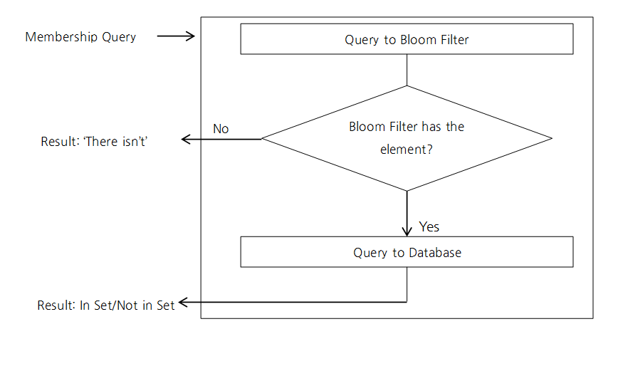
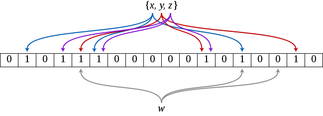

# 서론

[Hash(1) 포스트](https://longnh214.github.io/posts/Java_Hash_1/)와 [Hash(2) 포스트](https://longnh214.github.io/posts/Java_Hash_2/)에서 해시에 대해 공부했었다. 그에 나아가서 확률적 자료구조인 **Bloom Filter**에 대해서 알아보고 해시와 어떤 점에서 관련 있는지 보고자 한다.  

# Bloom Filter

> 간단하게 해시 함수 결과값을 이용해서 집합 내에 특정 원소가 존재하는지 확인할 때 사용하는 확률적 자료구조라고 생각하면 된다.  
> 특정 A와 B라는 값이 있으면 둘의 해시값이 각각 a와 b로 나올텐데, 이 두 값이 같다면(if(a == b)) A와 B도 같을 확률이 있다는 것이다.  
> 하지만 A와 B의 해시값이 애초에 다르다면 원래 값 A와 B를 비교하기도 전에 해시값부터 다르기 때문에 같은 값이 아니라는 것이 보장된다는 확률론을 의미한다.

## Bloom Filter의 사용 예시

<div style="text-align: center;">
    
</div>

위 예시 흐름에 대해서 요약해본다.

1. 쿼리에 대한 결과 존재 확률을 판단하게 위해 먼저 Bloom Filter에서 판별한다.
   - 없다고 판별됐다면 없다고 바로 결과를 반환한다.  
   - 있다고 판별됐다면 실제 DB에 쿼리를 날려서 호출한다.
      - 해당 결과가 있는지 없는지 반환한다.

> 위에서는 DB의 조회에 Bloom Filter 방식을 어떻게 접목 시켰는지 예시로 들었다.  
> Bloom Filter에서 1차적으로 원소가 존재할 확률을 판별해서 확실히 없을 것이라는 확률이 나온다면 실제 DB 통신까지 가지 않고 탐색을 종료해서 성능 향상을 기대할 수 있다.

## Bloom Filter에서 특정 원소를 찾는 방법

<div style="text-align: center;">
    
</div>

**Bloom Filter**에서 특정 원소를 찾는 방법에 대해서 위 그림을 참고해서 설명하고자 한다.

Bloom Filter는 내부적으로 m개의 비트를 담을 수 있는 배열의 형태로 구성된다. 그리고 해시 함수는 각각의 입력 값에 대해서 0~m-1 범위의 값을 반환할 것이다. 예시에서는 3개의 해시 함수를 사용한 Bloom Filter이다.

우선 `x`에 대한 해시 함수의 반환값은 각각 1, 5, 13이 나왔다. 그러므로 Bloom Filter 배열의 해시 함수 반환값에 대한 인덱스의 비트를 1로 바꿔준다.  
이와 같은 방법으로 Bloom Filter `y, z`에 대한 처리도 진행했다.

`x, y, z` 원소의 존재를 Bloom Filter에 표시하고, `w` 원소가 존재하는 지 판별해보고자 한다. `w` 원소에 대한 해시 함수 반환 값은 각각 4, 13, 15이다. Bloom Filter에 4와 13에 대해서는 비트가 켜져있지만 15에 대해서는 비트가 켜져있지 않다. 고로 `w` 원소는 존재하지 않음을 파악할 수 있다.  
(비트가 켜져있음을 배열 값이 1인 형태, 비트가 꺼져있음을 배열 값이 0인 형태라고 생각했다.)

> 💡 하지만, Bloom Filter에 특정 원소에 대한 해시 함수 반환값 비트가 모두 켜져있더라도 실제로 원소가 존재할 지는 직접 확인해봐야한다.

<br>

# False positive

**False positive**란 Bloom Filter에서 존재한다고 반환했지만 실제로 원소를 조회하면 없는 경우를 의미한다.  
이 경우가 발생하는 이유는, 해시 함수에 대한 해시 충돌이 불가피하기 때문이다.

[Bloom Filter Calculator](https://hur.st/bloomfilter/) 사이트에서 아래의 조건에 대한 False positive 확률을 계산할 수 있다고 한다.

```text
n : Bloom Filter에 등록된 아이템
p : False positive의 확률. 0~1 범위
m : Bloom Filter의 비트 수
k : 해시 함수의 갯수
```

## 결론

Bloom Filter를 통해 확률적으로 원소가 존재하는 지 확인할 수 있다는 점은 장점으로 다가왔다. 구현도 크게 어려울 것 같지는 않다. 하지만 단점이라면 원소를 삭제하더라도 Bloom Filter에 표시할 수 없다. 왜냐하면 해당 비트가 다른 원소와 관련이 있을 수 있기 때문이다.  
따라서 **삭제가 될 수 없는 데이터에 대해서 Bloom Filter를 적용하는 것이 좋겠다.**  

Java의 guava 패키지에 Bloom Filter에 대한 구현체가 있다고 한다.

## 출처

- [Naver D2 - Bloom Filter](https://d2.naver.com/helloworld/749531)
- [Bloom Filter, 제대로 이해하기 - Java](https://gngsn.tistory.com/201)
